# Deploying a Machine Learning Model on AWS with Docker, AWS Lambda, AWS API Gateway and AWS DynamoDB

The first thing to do is check if ```virtualenv``` is installed in your computer. If you are on Linux you can check this by running ```virtualenv --version```. If is not installed you can go to *pypi.org* and intall ([link](https://pypi.org/project/virtualenv/)).

Next, go to the directory that you want to work and run the command: ```virtualenv -p python my_env```. After this, activate your virtual enviroment by typing in the terminal inside your currently directory the following command: ```source ./my_env/bin/activate```.

For this tutorial we are going to deploy a simple regression model as our main goal is to show how to deploy and integrate our model with AWS Lambda, API Gateway and DynamoDB.

## Preparing the simple regression model

### Preparing the data and saving the model

We are going to intall the *sklearn* library to instatiate our regression model. To so, we need to install the library by running the command: ```pip install -U scikit-learn```. 

The model that we are going to use is present in the **notebook.ipynb** file. All the steps to prepare the data and to save the model are present in this notebook. Note that we use the *pickle* library to save the model.

(Note that we also install the *matplotlib* library to plot our data (run the command: ```pip install matplotlib```).)

### Reading the model and preparing the *predict* function

As we are going to see, AWS Lambda use a **lambda_handler** function to deal with the events (each predict trigger), so we called our predict function as *lambda_handler* inside our *lambda_function.py* file.

We also need to install the AWS *boto3* SDK to integrate our code with AWS DynamoDB. To install this framework you need to run ```pip install boto3```.

Note that the *lambda_function.py* file contains our **predict** function and makes the integration with AWS DynamoDB.

### Preparing the Dockerfile

As we are using the *virtualenv* to track our requirements, we need to pass all the packages that we used to a ```requirements.txt``` file. To do this we run the following command in the directory that we are working: ```pip freeze > requirements.txt```. 

After this, we already to create our *Dockerfile*. 

The Dockerfile used is present below:

```{bash}

FROM public.ecr.aws/lambda/python:3.8

COPY requirements.txt  ./

RUN  pip install -r requirements.txt --target "${LAMBDA_TASK_ROOT}"

COPY linear_model.bin ${LAMBDA_TASK_ROOT}
COPY lambda_function.py ${LAMBDA_TASK_ROOT}

CMD [ "lambda_function.lambda_handler" ] 

```

To build our image we need to run ```docker build -t aws-example .```

After all this, we already to go to the AWS Console and prepare our environment to deploy our model.

## Working in the AWS Cloud

Go to the AWS Console and signin or create an account.

After this, you should see something like this:

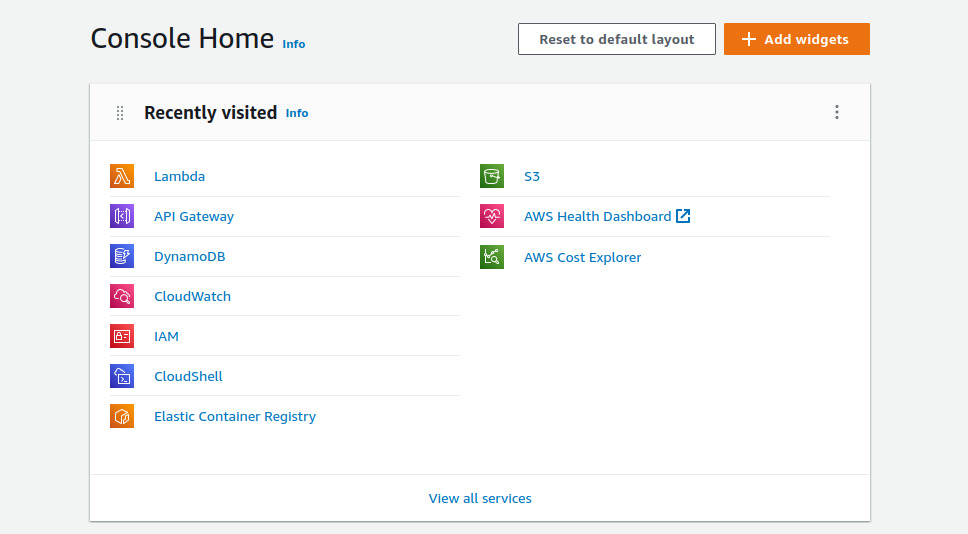

### Create a table in DynamoDB

Search for the AWS DynamoDB service and go to the **create table** button.

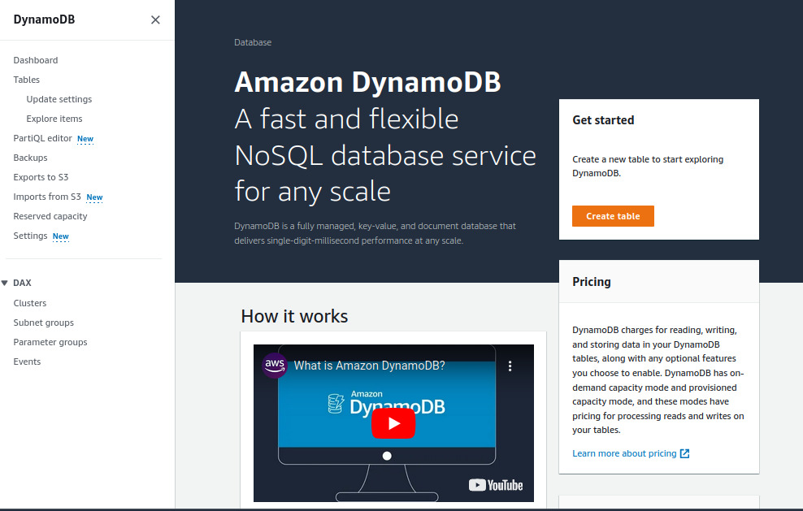

Add a **Table name** with the name "UserPrediction" (the name that we used inside our lamabda_handler function). Also add a **Partition Key** called "username" and then click on **Create Table** button.

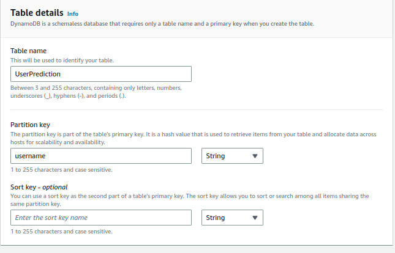

### Create a Lambda Function

#### Create an IAM Role

Before we create a lambda function, we need to create a Lambda Role to give to our lambda function the access to DynamoDB.

Search for **IAM** in the AWS Console and go to *Roles*, then click on **Create Role**.
After this, select **AWS service** for *Trusted entity type* and in *Use Case* select **Lambda**, then click in **Next**.

In the search bar look for: 
- AmazonDynamoDBFullAccess
- AmazonElasticContainerRegistryPublicFullAccess

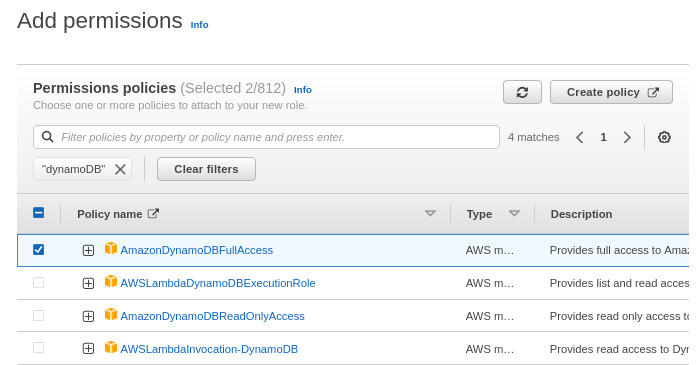

Then click in **Next** in the final of the page.

Enter with a *Role Name*, in our case the the name used is **aws-example** and click in **Create role** in the final of the page.

### Lambda Function

#### Create a image with AWS ECR

To use the AWS Lambda with AWS ECR we need first create a ECR repository.

Search in the console for ECR (Elastic Container Registry) and click on **Create repository**, then add the repository name in the *private visibility* and click in **Create repository**.

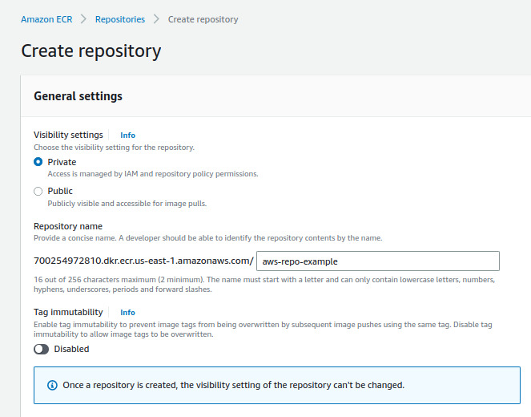

##### Push the Docker image to AWS ECR with AWS CLI

Is this step we need to use the AWS CLI to push our Docker image to our ECR repository. 

So we need to check if the *AWS CLI* is installed and if not, we need to install.
To check if is installed we can run ```aws --version```. If is not installed, you can follow the steps described [here](https://docs.aws.amazon.com/cli/latest/userguide/getting-started-install.html) to install or type ```sudo apt  install awscli``` on Ubuntu.

To configure your AWS CLI run ```aws configure```. (If you not set up your AWS Credentials you can do this going to *IAM>Users>YourUerName>Security credentials>Create access key*.)

After create your repository, go to this repository and click on **View push commands**.

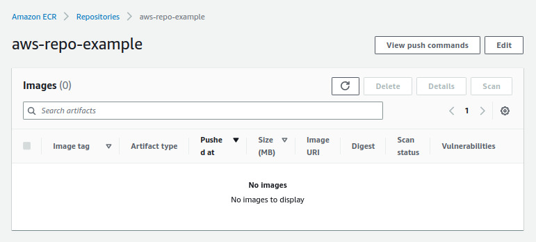

In the repository that you are working follow the steps describe in the *View push commands* (Steps 1 to 4. Note that you can scape step 2 if you put in the step 3 the Docker image that you created before.).

#### Lambda function

In the console again search for the **Lambda** service and in *Functions* click in **Create function**.

Then, select **Container image**, and in *Basic information* give a **Function name** (in our case the name is "lambdaExample"). You also need to select the *Container image URI*. To do this, click on **Browse images** and select the *repository* and the *latest image* that we pushed to ECR.

After this, go to *Change default execution role*, select **Use an existing role** and in *Existing role* select the role that we created (**aws-example**), and click on **Create function**.

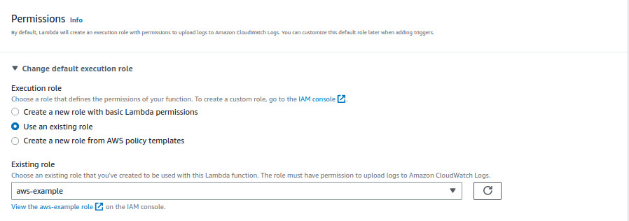


#### Testing the Lambda function

In the Lambda console, go to **Test** and **Create new event** with the name you want (in our case the name is "LambdaTest"), with the following structure:

```
{
    "X": [30, 45.7], 
    "user": {
        "username": "UserTest Name", 
        "age": 35
    }
}
```

Then, click in **Save** and **Test**.

After run the test you should see the following output: 

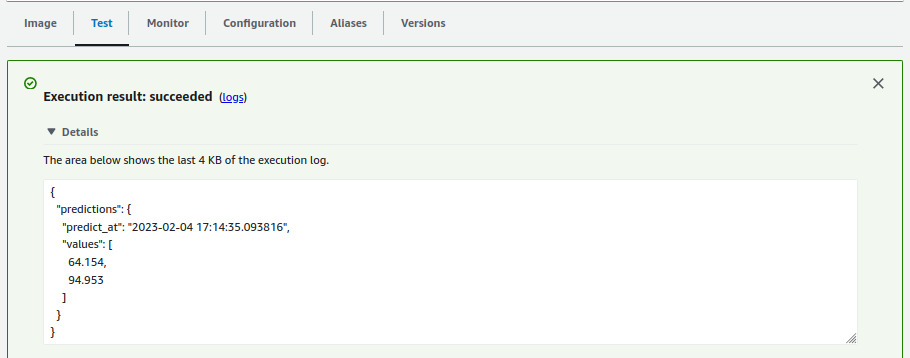

And if you go to the table created in DynamoDB you should also see that the information response it was put in the table.

### API Gateway

Finally, go to the AWS console and search for the API Gateway service. Then, search for **REST API** option and click on the **Build** button.

After this, follow the example in the image below and click **Create API**:

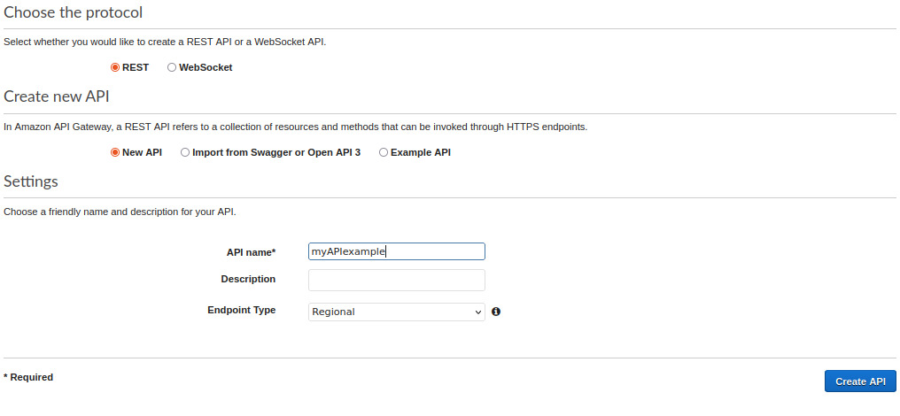

Now, go to ```Resources > Actions > Create resource``` and follow the example below and click on **Create Resource**:

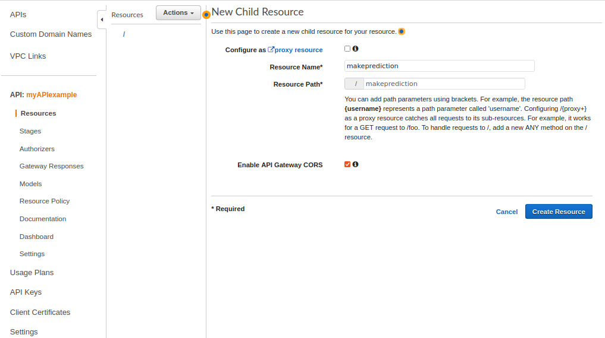

Click on the "/makeprediction" resource, then click on *Actions* to create a method to this resource. After this, follow the set up bellow:

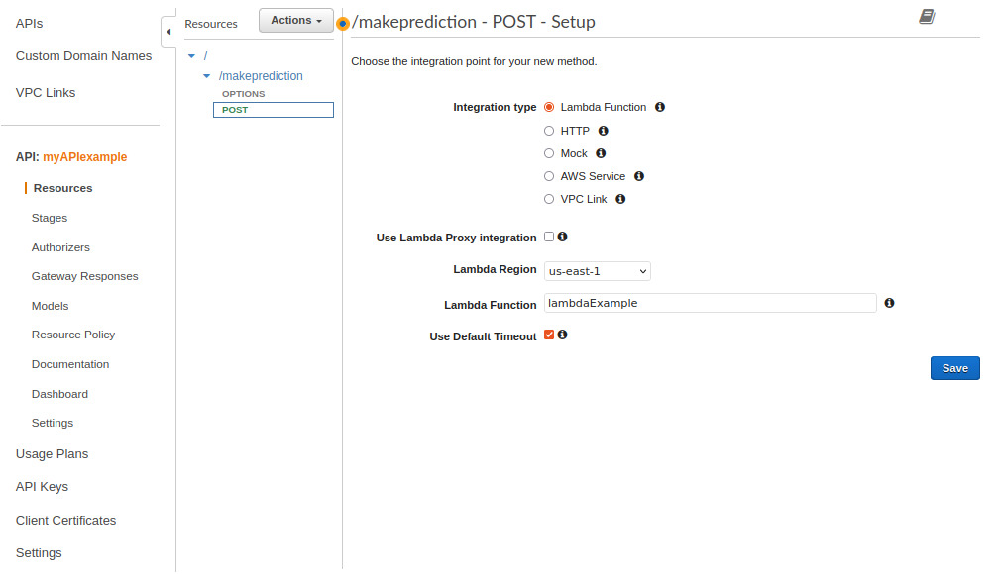

And that is it. After you click in **Save** you should see a page with a button called **Test** where you can scrow down to "Request Body" and put the event structure that we are using to test the API.


